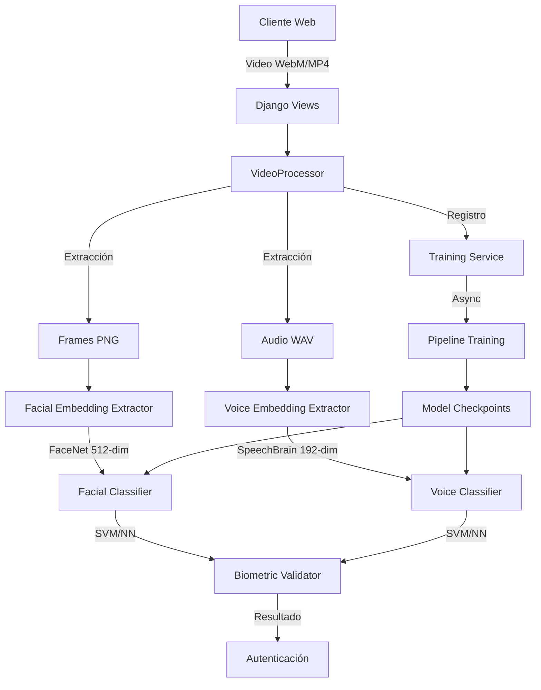
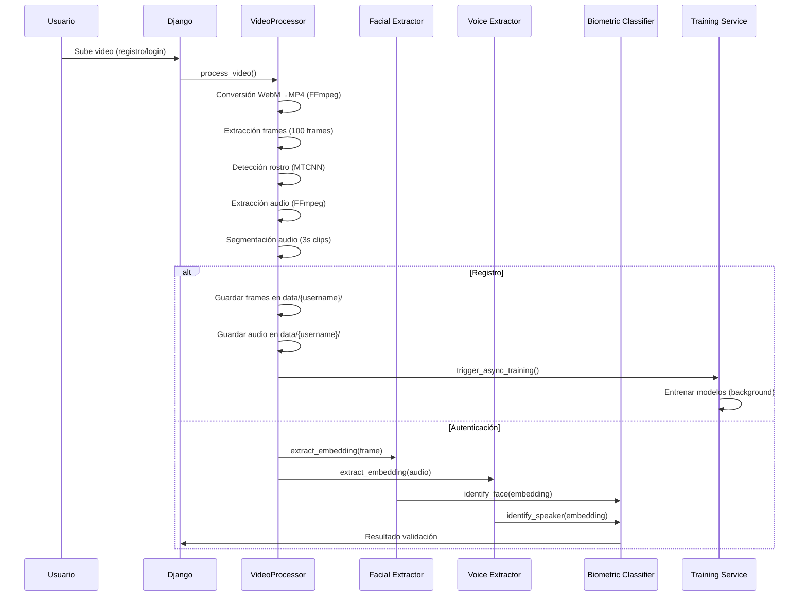
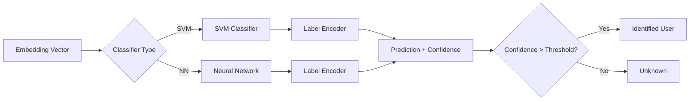
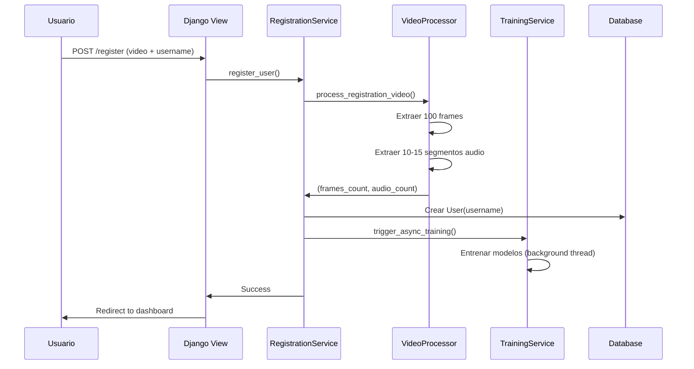
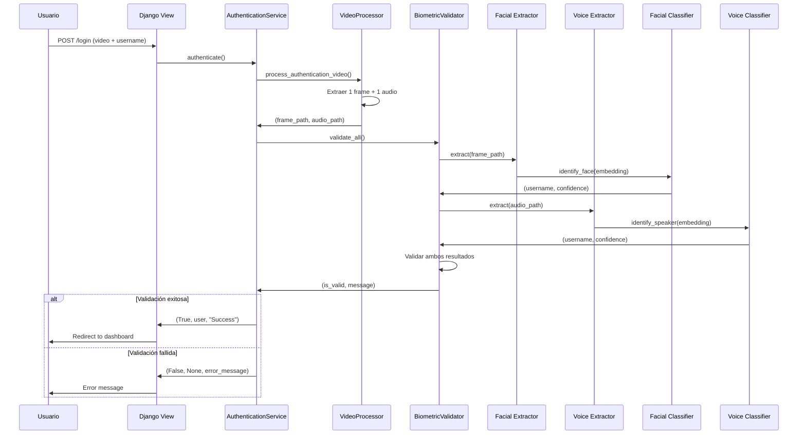
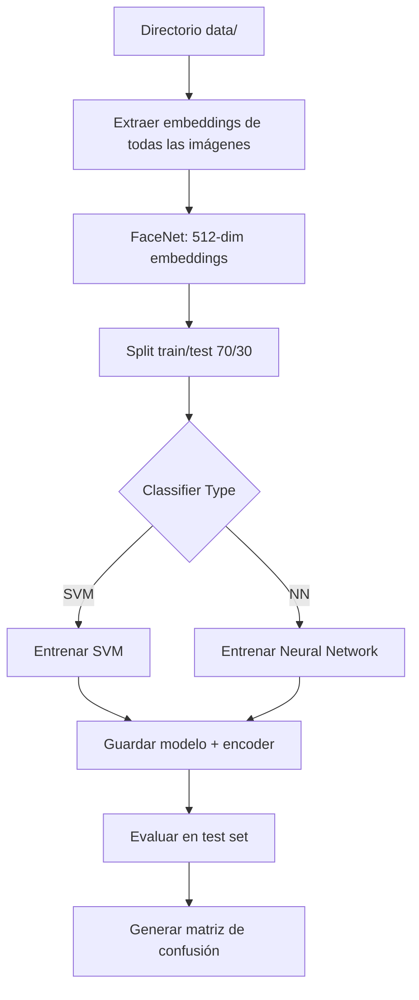

# Sistema de Autenticación Biométrica Multimodal con Video

## Resumen Ejecutivo

Este documento presenta la arquitectura, diseño e implementación de un sistema de autenticación biométrica multimodal que utiliza un único video como entrada para capturar simultáneamente características faciales y de voz. El sistema implementa un pipeline completo de procesamiento de video, extracción de características mediante modelos de deep learning pre-entrenados, y clasificación mediante algoritmos de machine learning (SVM o Redes Neuronales).

## 1. Introducción

### 1.1 Objetivo del Sistema

El sistema permite la autenticación de usuarios mediante características biométricas extraídas de un video de 10-15 segundos, eliminando la necesidad de archivos separados de imagen y audio. El sistema combina reconocimiento facial y de voz para proporcionar una autenticación robusta y segura.

### 1.2 Características Principales

- **Registro con Video Único**: Un solo video captura simultáneamente características faciales y de voz
- **Autenticación Basada en Username**: Sistema simplificado sin contraseñas tradicionales
- **Entrenamiento Automático**: Modelos se actualizan automáticamente tras cada registro
- **Procesamiento Asíncrono**: Entrenamiento en segundo plano, sin bloqueo de la aplicación
- **Doble Validación Biométrica**: Facial + Voz para mayor seguridad
- **Arquitectura Modular**: Clasificadores intercambiables (SVM o Neural Network)

## 2. Arquitectura del Sistema

### 2.1 Arquitectura General



### 2.2 Pipeline de Procesamiento de Video



### 2.3 Arquitectura de Clasificadores



## 3. Componentes del Sistema

### 3.1 Procesamiento de Video

El componente `VideoProcessor` es responsable de la extracción de datos biométricos del video de entrada.

#### 3.1.1 Extracción de Frames

- **Tecnología**: OpenCV + MTCNN (FaceNet)
- **Parámetros**:
  - `REQUIRED_FRAMES = 100`: Número de frames con rostro detectado requeridos
  - `MIN_VIDEO_DURATION_SECONDS = 30`: Duración mínima del video
  - `image_size = 160`: Tamaño de imagen para FaceNet
  - `min_face_size = 20`: Tamaño mínimo de rostro detectado

**Proceso**:
1. Conversión de WebM a MP4 (si es necesario) usando FFmpeg
2. Lectura del video frame por frame
3. Detección de rostro en cada frame usando MTCNN
4. Extracción y recorte del rostro
5. Guardado como imagen PNG (160x160 píxeles)

#### 3.1.2 Extracción de Audio

- **Tecnología**: FFmpeg + SoundFile
- **Parámetros**:
  - `AUDIO_SEGMENT_DURATION = 3`: Duración de cada segmento en segundos
  - `MIN_AUDIO_SEGMENTS = 10`: Mínimo de segmentos requeridos
  - `MAX_AUDIO_SEGMENTS = 15`: Máximo de segmentos permitidos
  - `sample_rate = 16000`: Tasa de muestreo para SpeechBrain

**Proceso**:
1. Extracción de pista de audio del video usando FFmpeg
2. Conversión a formato WAV (PCM 16-bit, mono, 16kHz)
3. Segmentación del audio en clips de 3 segundos
4. Guardado de cada segmento como archivo WAV individual

### 3.2 Extracción de Embeddings

#### 3.2.1 Embeddings Faciales (FaceNet)

**Modelo**: InceptionResnetV1 pre-entrenado en VGGFace2

- **Arquitectura**: Red neuronal convolucional Inception-ResNet
- **Dimensión de embedding**: 512 características
- **Preprocesamiento**:
  - Detección de rostro con MTCNN
  - Normalización a 160x160 píxeles
  - Normalización de valores de píxel

**Implementación**:
```python
# Pseudocódigo del proceso
mtcnn = MTCNN(image_size=160, margin=0, min_face_size=20)
resnet = InceptionResnetV1(pretrained='vggface2').eval()

face_tensor = mtcnn(image)  # Detección y normalización
embedding = resnet(face_tensor)  # Extracción de características
# Resultado: vector de 512 dimensiones
```

#### 3.2.2 Embeddings de Voz (SpeechBrain)

**Modelo**: ECAPA-TDNN pre-entrenado en VoxCeleb (`speechbrain/spkrec-ecapa-voxceleb`)

- **Arquitectura**: ECAPA-TDNN (Emphasized Channel Attention, Propagation and Aggregation)
- **Dimensión de embedding**: 192 características
- **Preprocesamiento**:
  - Conversión a mono si es estéreo
  - Resampling a 16kHz si es necesario
  - Normalización de amplitud

**Implementación**:
```python
# Pseudocódigo del proceso
encoder = EncoderClassifier.from_hparams(
    source="speechbrain/spkrec-ecapa-voxceleb"
)

audio_signal = load_audio(audio_path)  # Carga y preprocesamiento
embedding = encoder.encode_batch(audio_signal)  # Extracción
# Resultado: vector de 192 dimensiones
```

### 3.3 Clasificadores

El sistema implementa dos tipos de clasificadores intercambiables mediante el patrón Strategy.

#### 3.3.1 Clasificador SVM (Support Vector Machine)

**Implementación**: Scikit-learn `SVC`

**Parámetros de entrenamiento**:
- `kernel='rbf'`: Kernel de función de base radial (RBF)
- `probability=True`: Habilita cálculo de probabilidades
- `random_state=42`: Semilla para reproducibilidad

**Características**:
- **Ventajas**: 
  - Entrenamiento rápido
  - Bajo consumo de memoria
  - Buen rendimiento con datasets pequeños
- **Desventajas**:
  - Menor precisión que redes neuronales en datasets grandes
  - No aprende representaciones jerárquicas

**Proceso de clasificación**:
1. Carga del modelo SVM entrenado y LabelEncoder
2. Predicción de probabilidades: `predict_proba(embedding)`
3. Selección de clase con mayor probabilidad
4. Comparación con umbral de confianza:
   - Facial: `CONFIDENCE_THRESHOLD = 0.75`
   - Voz: `CONFIDENCE_THRESHOLD = 0.75`
5. Retorno de identidad o "unknown" si confianza < umbral

**Estructura de datos**:
- **Entrada**: Vector de embeddings (512-dim facial, 192-dim voz)
- **Salida**: Tupla `(username, confidence_score)`

#### 3.3.2 Clasificador de Red Neuronal

**Arquitectura**: Red neuronal feedforward con capas fully-connected

**Arquitectura para Facial (512-dim input)**:
```
Input (512) 
  → FC1 (256) + BatchNorm + ReLU + Dropout(0.3)
  → FC2 (128) + BatchNorm + ReLU + Dropout(0.3)
  → FC3 (num_classes) → Softmax
```

**Arquitectura para Voz (192-dim input)**:
```
Input (192)
  → FC1 (128) + BatchNorm + ReLU + Dropout(0.3)
  → FC2 (64) + BatchNorm + ReLU + Dropout(0.3)
  → FC3 (num_classes) → Softmax
```

**Parámetros de entrenamiento**:
- `epochs = 100`: Número de épocas
- `batch_size = 32`: Tamaño de lote
- `learning_rate = 0.001`: Tasa de aprendizaje inicial
- `optimizer = Adam`: Optimizador Adam
- `loss = CrossEntropyLoss`: Función de pérdida
- `scheduler = ReduceLROnPlateau`: Reducción de learning rate en meseta
  - `factor = 0.5`: Factor de reducción
  - `patience = 10`: Paciencia antes de reducir

**Características**:
- **Ventajas**:
  - Mayor precisión en datasets grandes
  - Capacidad de aprender representaciones complejas
  - Mejor generalización con datos variados
- **Desventajas**:
  - Entrenamiento más lento
  - Mayor consumo de memoria
  - Requiere más datos para evitar overfitting

**Proceso de clasificación**:
1. Carga del modelo PyTorch y LabelEncoder
2. Forward pass: `model(embedding_tensor)`
3. Aplicación de softmax para obtener probabilidades
4. Selección de clase con mayor probabilidad
5. Comparación con umbral de confianza
6. Retorno de identidad o "unknown"

### 3.4 Integración con Django

#### 3.4.1 Flujo de Registro



#### 3.4.2 Flujo de Autenticación



#### 3.4.3 Carga Dinámica de Modelos

El sistema utiliza `ModelLoader` para cargar dinámicamente los clasificadores según la configuración:

```python
# Configuración desde variables de entorno
FACIAL_CLASSIFIER_TYPE = os.getenv('FACIAL_CLASSIFIER_TYPE', 'svm')
VOICE_CLASSIFIER_TYPE = os.getenv('VOICE_CLASSIFIER_TYPE', 'svm')

# Carga condicional
if classifier_type == 'svm':
    model = joblib.load(svm_model_path)
elif classifier_type == 'nn':
    model = load_pytorch_model(nn_model_path)
```

**Rutas de modelos**:
- Facial SVM: `models/facial/checkpoints/svm_classifier.joblib`
- Facial NN: `models/facial/checkpoints/nn_classifier.pth`
- Voz SVM: `models/voice/checkpoints/svm_classifier.joblib`
- Voz NN: `models/voice/checkpoints/nn_classifier.pth`

## 4. Entrenamiento de Modelos

### 4.1 Pipeline de Entrenamiento

El entrenamiento se realiza mediante scripts independientes ubicados en `models/facial/pipeline.py` y `models/voice/pipeline.py`.

#### 4.1.1 Proceso de Entrenamiento Facial



**Datos de entrada**:
- Estructura: `models/facial/data/{username}/*.png`
- Formato: Imágenes PNG 160x160 píxeles (rostros recortados)
- Mínimo recomendado: 10-20 imágenes por usuario

**Proceso detallado**:
1. **Extracción de embeddings**:
   ```python
   for username in data_dir:
       for image_path in username_dir:
           embedding = extract_embedding(image_path)  # FaceNet
           X.append(embedding)  # 512-dim vector
           y.append(username)   # Label
   ```

2. **División de datos**:
   - Train: 70% (aleatorio, `random_state=42`)
   - Test: 30%

3. **Entrenamiento SVM**:
   ```python
   label_encoder = LabelEncoder()
   y_encoded = label_encoder.fit_transform(y_train)
   svm = SVC(kernel='rbf', probability=True)
   svm.fit(X_train, y_encoded)
   ```

4. **Entrenamiento Neural Network**:
   ```python
   model = FaceClassifier(embedding_dim=512, num_classes=num_classes)
   optimizer = Adam(model.parameters(), lr=0.001)
   for epoch in range(100):
       # Forward pass, backward pass, update weights
   ```

5. **Guardado**:
   - Modelo: `checkpoints/{svm_classifier.joblib|nn_classifier.pth}`
   - Label Encoder: `checkpoints/{label_encoder.joblib|nn_label_encoder.joblib}`

#### 4.1.2 Proceso de Entrenamiento de Voz

**Datos de entrada**:
- Estructura: `models/voice/data/{username}/*.wav`
- Formato: Audio WAV, 16kHz, mono, PCM 16-bit
- Duración: Segmentos de 3 segundos cada uno
- Mínimo recomendado: 10-15 segmentos por usuario

**Proceso detallado**:
1. **Extracción de embeddings**:
   ```python
   for username in data_dir:
       for audio_path in username_dir:
           embedding = extract_embedding(audio_path)  # SpeechBrain
           X.append(embedding)  # 192-dim vector
           y.append(username)   # Label
   ```

2. **Entrenamiento**: Similar al proceso facial, pero con embeddings de 192 dimensiones

### 4.2 Entrenamiento Manual

#### 4.2.1 Comandos Makefile

```bash
# Entrenar modelos faciales
make train-facial-svm    # Entrenar con SVM
make train-facial-nn     # Entrenar con Neural Network

# Entrenar modelos de voz
make train-voice-svm     # Entrenar con SVM
make train-voice-nn      # Entrenar con Neural Network
```

#### 4.2.2 Comandos Directos

```bash
# Facial
cd models/facial
python pipeline.py --classifier svm   # o 'nn'

# Voz
cd models/voice
python pipeline.py --classifier svm   # o 'nn'
```

### 4.3 Entrenamiento Automático

El sistema activa el entrenamiento automáticamente después de cada registro mediante `TrainingService`.

**Características**:
- **Asíncrono**: Se ejecuta en un thread separado (no bloquea la aplicación)
- **Thread-safe**: Utiliza locks para evitar entrenamientos simultáneos
- **Configurable**: Respeta `FACIAL_CLASSIFIER_TYPE` y `VOICE_CLASSIFIER_TYPE`

**Implementación**:
```python
class TrainingService:
    _training_lock = threading.Lock()
    _is_training = False
    
    @classmethod
    def trigger_async_training(cls):
        if cls.is_training():
            return  # Skip si ya está entrenando
        
        thread = threading.Thread(
            target=cls._train_models,
            daemon=True
        )
        thread.start()
```

## 5. Uso de Modelos

### 5.1 Identificación Facial

**Proceso**:
1. Carga de imagen o frame de video
2. Extracción de embedding con FaceNet (512-dim)
3. Clasificación con modelo entrenado (SVM o NN)
4. Retorno de identidad y confianza

**Umbral de confianza**: 0.75 (configurable)

**Ejemplo de uso**:
```python
from authentication.utils import identify_face_from_image

identified_person, confidence = identify_face_from_image(image_path)
if identified_person != "unknown" and confidence >= 0.75:
    print(f"Identificado: {identified_person} (confianza: {confidence:.2f})")
```

### 5.2 Identificación de Voz

**Proceso**:
1. Carga de archivo de audio
2. Preprocesamiento (conversión de formato si es necesario)
3. Extracción de embedding con SpeechBrain (192-dim)
4. Clasificación con modelo entrenado
5. Retorno de identidad y confianza

**Umbral de confianza**: 0.3 (configurable)

**Ejemplo de uso**:
```python
from authentication.utils import identify_speaker_from_audio

identified_speaker, confidence = identify_speaker_from_audio(audio_path)
if identified_speaker != "unknown" and confidence >= 0.3:
    print(f"Identificado: {identified_speaker} (confianza: {confidence:.2f})")
```

### 5.3 Validación Biométrica Completa

El sistema valida ambas modalidades (facial + voz) para mayor seguridad:

```python
from authentication.validators import BiometricValidator

validator = BiometricValidator()
is_valid, message = validator.validate_all(
    audio_path=audio_path,
    image_path=image_path,
    expected_name=username
)
```

**Lógica de validación**:
1. Validación de voz primero
2. Si voz es válida, validación facial
3. Ambas deben coincidir con el username esperado
4. Ambas deben superar sus umbrales de confianza

## 6. Dependencias Externas Críticas

### 6.1 FFmpeg

**Rol crítico**: FFmpeg es una dependencia fundamental del sistema, utilizada para:

1. **Conversión de formatos de video**:
   - WebM → MP4 (para compatibilidad con OpenCV)
   - Comando: `ffmpeg -i input.webm -c:v libx264 -preset fast output.mp4`

2. **Extracción de audio**:
   - Extracción de pista de audio desde video
   - Conversión a WAV (PCM 16-bit, mono, 16kHz)
   - Comando: `ffmpeg -i video.mp4 -vn -acodec pcm_s16le -ar 16000 -ac 1 audio.wav`

3. **Procesamiento de audio**:
   - Conversión de formatos de audio (WebM audio → WAV)
   - Resampling a 16kHz (requerido por SpeechBrain)

**Instalación**:
```bash
# macOS
brew install ffmpeg

# Ubuntu/Debian
sudo apt-get install ffmpeg

# Windows
# Descargar desde https://ffmpeg.org/download.html
```

**Verificación**:
```bash
ffmpeg -version
```

**Impacto si no está disponible**:
- El sistema no puede procesar videos WebM
- No puede extraer audio de videos
- El registro y autenticación fallan

### 6.2 Otras Dependencias Importantes

#### 6.2.1 FaceNet (facenet-pytorch)
- **Uso**: Extracción de embeddings faciales
- **Modelo**: InceptionResnetV1 pre-entrenado en VGGFace2
- **Descarga automática**: Se descarga al primer uso (~100MB)

#### 6.2.2 SpeechBrain
- **Uso**: Extracción de embeddings de voz
- **Modelo**: ECAPA-TDNN pre-entrenado en VoxCeleb
- **Descarga automática**: Se descarga desde Hugging Face Hub (~500MB)

#### 6.2.3 OpenCV (opencv-python)
- **Uso**: Procesamiento de video, lectura de frames, escritura de imágenes
- **Versión**: >= 4.8.0

#### 6.2.4 PyTorch
- **Uso**: 
  - Modelos de deep learning (FaceNet, SpeechBrain)
  - Clasificadores de red neuronal
  - Procesamiento de tensores
- **Versión**: >= 2.1.0

## 7. Configuración del Sistema

### 7.1 Variables de Entorno

Crear archivo `.env` en la raíz del proyecto:

```bash
# Django Settings
SECRET_KEY=your-secret-key-here
DEBUG=True

# Database Configuration
DB_NAME=auth_platform
DB_USER=postgres
DB_PASSWORD=postgres
DB_HOST=localhost
DB_PORT=5432

# Biometric Classifier Configuration
FACIAL_CLASSIFIER_TYPE=svm    # Opciones: 'svm' o 'nn'
VOICE_CLASSIFIER_TYPE=svm     # Opciones: 'svm' o 'nn'
```

### 7.2 Parámetros Configurables

#### 7.2.1 VideoProcessor

Ubicación: `src/authentication/services/video_processor.py`

```python
REQUIRED_FRAMES = 100              # Frames con rostro requeridos
AUDIO_SEGMENT_DURATION = 3          # Duración de segmentos de audio (segundos)
MIN_AUDIO_SEGMENTS = 10             # Mínimo de segmentos de audio
MAX_AUDIO_SEGMENTS = 15             # Máximo de segmentos de audio
MIN_VIDEO_DURATION_SECONDS = 30     # Duración mínima del video
```

#### 7.2.2 Umbrales de Confianza

Ubicación: `src/authentication/biometrics/config.py`

```python
FACIAL_CONFIDENCE_THRESHOLD = 0.75  # Umbral para reconocimiento facial
VOICE_CONFIDENCE_THRESHOLD = 0.75     # Umbral para reconocimiento de voz
```

#### 7.2.3 Parámetros de Entrenamiento Neural Network

Ubicación: `models/{facial|voice}/classifiers/nn_classifier.py`

```python
epochs = 100
batch_size = 32
learning_rate = 0.001
dropout_rate = 0.3
```

## 8. Estructura del Proyecto

```
facial-recognition/
├── models/
│   ├── facial/
│   │   ├── data/                    # Frames extraídos por usuario
│   │   │   ├── {username}/
│   │   │   │   └── *.png
│   │   ├── checkpoints/              # Modelos entrenados
│   │   │   ├── svm_classifier.joblib
│   │   │   ├── label_encoder.joblib
│   │   │   ├── nn_classifier.pth
│   │   │   └── nn_label_encoder.joblib
│   │   ├── classifiers/
│   │   │   ├── classifier_strategy.py  # Patrón Strategy
│   │   │   ├── svm_classifier.py
│   │   │   └── nn_classifier.py
│   │   └── pipeline.py               # Script de entrenamiento
│   └── voice/
│       ├── data/                     # Segmentos de audio por usuario
│       │   ├── {username}/
│       │   │   └── *.wav
│       ├── checkpoints/              # Modelos entrenados
│       ├── classifiers/              # Similar a facial
│       └── pipeline.py
├── src/
│   ├── auth_platform/               # Configuración Django
│   │   ├── settings.py
│   │   └── urls.py
│   └── authentication/               # App principal
│       ├── models.py                # User model
│       ├── views.py                 # Django views
│       ├── services/
│       │   ├── video_processor.py   # Procesamiento de video
│       │   ├── training_service.py # Entrenamiento asíncrono
│       │   ├── registration_service.py
│       │   └── authentication_service.py
│       ├── biometrics/
│       │   ├── config.py            # Configuración
│       │   ├── embedding_extractors.py  # FaceNet + SpeechBrain
│       │   ├── model_loaders.py     # Carga de modelos
│       │   └── identifiers.py
│       └── validators/
│           ├── biometric_validator.py
│           └── base_validator.py
├── pyproject.toml                    # Dependencias Python
├── docker-compose.yml                # PostgreSQL
├── Makefile                          # Comandos útiles
└── README.md
```

## 9. Instalación y Configuración

### 9.1 Requisitos del Sistema

- Python 3.12
- PostgreSQL 12+
- FFmpeg (instalación del sistema)
- Navegador moderno con soporte para MediaRecorder API

### 9.2 Instalación

```bash
# 1. Clonar repositorio
git clone <repository-url>
cd facial-recognition

# 2. Instalar FFmpeg
brew install ffmpeg  # macOS
# o
sudo apt-get install ffmpeg  # Linux

# 3. Instalar dependencias Python
uv sync

# 4. Configurar variables de entorno
cp .env.example .env
# Editar .env con tus configuraciones

# 5. Configurar base de datos
docker compose up -d
cd src
python manage.py migrate

# 6. (Opcional) Entrenar modelos iniciales
make train-facial-svm
make train-voice-svm
```

### 9.3 Iniciar Servidor

```bash
cd src
python manage.py runserver
```

Acceder a: `http://localhost:8000`

## 10. Uso del Sistema

### 10.1 Registro de Usuario

1. Navegar a `/register`
2. Ingresar username único
3. Grabar video (10-15 segundos):
   - Mover cabeza suavemente (izquierda/derecha, arriba/abajo)
   - Hablar claramente:
     - "Soy [tu nombre]"
     - "Esta es mi voz"
     - "Estoy registrándome en el sistema"
4. Revisar video y completar registro
5. El sistema procesará el video y entrenará los modelos automáticamente

### 10.2 Autenticación

1. Navegar a `/login`
2. Ingresar username
3. Grabar nuevo video con las mismas características
4. El sistema validará datos biométricos
5. Acceso concedido si la validación es exitosa

## 11. Rendimiento y Métricas

### 11.1 Tiempos de Procesamiento

| Operación             | Tiempo Estimado |
| --------------------- | --------------- |
| Subida de video       | 2-5 segundos    |
| Extracción de frames  | 1-2 segundos    |
| Extracción de audio   | 1-2 segundos    |
| Validación biométrica | 2-3 segundos    |
| Entrenamiento (async) | 30-120 segundos |

### 11.2 Precisión

Los modelos generan matrices de confusión durante el entrenamiento:
- `confusion_matrix_facial_{svm|nn}.png`
- `confusion_matrix_voice_{svm|nn}.png`

La precisión típica:
- **Facial SVM**: 85-95% (depende del dataset)
- **Facial NN**: 90-98%
- **Voz SVM**: 80-90%
- **Voz NN**: 85-95%

## 12. Seguridad

- Sin almacenamiento de contraseñas (100% biométrico)
- Videos temporales eliminados tras procesamiento
- Transmisión HTTPS obligatoria en producción
- Modelos almacenados de forma segura en servidor
- Gestión de sesiones Django estándar
- Validación dual (facial + voz) para mayor seguridad

## 13. Troubleshooting

### 13.1 "Failed to open video file"
- Verificar instalación de FFmpeg: `ffmpeg -version`
- Comprobar formato de video compatible

### 13.2 "Biometric validation failed"
- Asegurar buena iluminación
- Hablar claramente durante grabación
- Mantener cara visible todo el tiempo
- Verificar que los modelos estén entrenados

### 13.3 Entrenamiento lento
- Primera vez con muchos usuarios toma más tiempo
- Entrenamientos subsecuentes son incrementales
- Verificar proceso Python no está colgado

### 13.4 "No faces found in image"
- Verificar que el video contenga rostros visibles
- Asegurar buena iluminación
- Verificar que MTCNN pueda detectar rostros

## 14. Referencias Técnicas

### 14.1 Modelos Pre-entrenados

- **FaceNet**: Schroff, F., Kalenichenko, D., & Philbin, J. (2015). FaceNet: A unified embedding for face recognition and clustering. CVPR.
- **SpeechBrain ECAPA-TDNN**: Desplanques, B., et al. (2020). ECAPA-TDNN: Emphasized Channel Attention, Propagation and Aggregation in TDNN Based Speaker Verification. Interspeech.

### 14.2 Bibliotecas Principales

- Django 5.0+: Framework web
- PyTorch 2.1+: Deep learning
- Scikit-learn: Machine learning (SVM)
- OpenCV: Procesamiento de video
- FFmpeg: Procesamiento multimedia

## 15. Mejoras Futuras

- [ ] Detección de vida (anti-replay)
- [ ] Autenticación multi-factor opcional
- [ ] Preprocesamiento de calidad de video
- [ ] Feedback en tiempo real de calidad de frame
- [ ] Actualizaciones progresivas de modelos
- [ ] Soporte para múltiples dispositivos por usuario
- [ ] API REST para integración externa
- [ ] Dashboard de administración con métricas

---

**Versión del Documento**: 1.0  
**Última Actualización**: 2024
