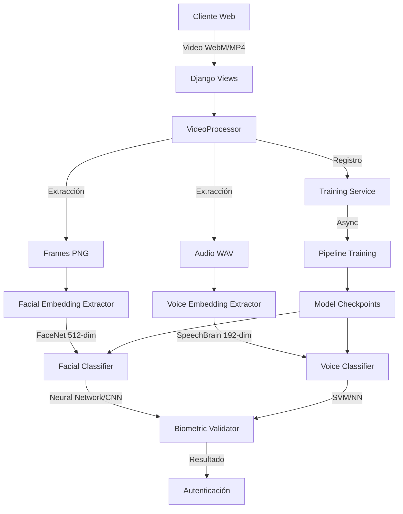
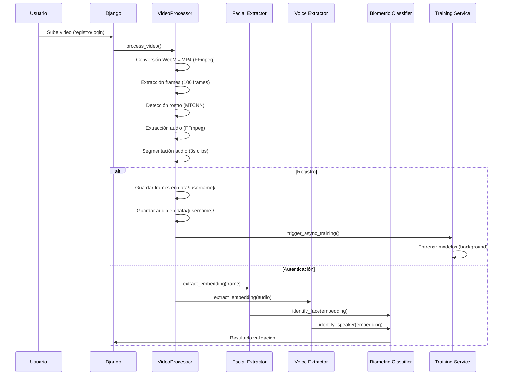
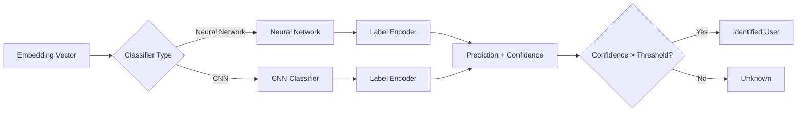

# Multimodal Biometric Authentication System

This project is a multimodal biometric authentication system that uses a single video to capture both facial and voice characteristics for user authentication. The system is built with Python, Django, and a number of machine learning and deep learning libraries.

## Features

- **Single Video Registration**: Captures both facial and voice data from a single 10-15 second video.
- **Passwordless Authentication**: Users are authenticated based on their username and biometric data.
- **Automatic Training**: The models are automatically updated after each new user registration.
- **Asynchronous Processing**: Model training is done in the background to avoid blocking the application.
- **Dual Biometric Validation**: Uses both facial and voice recognition for enhanced security.
- **Modular Architecture**: Allows for interchangeable classifiers (e.g., Neural Networks, CNNs).
- **Liveness Detection**: The system can detect liveness to prevent spoofing attacks.

## System Architecture

The system is composed of a web application built with Django that handles user registration and authentication. When a user registers, a video is recorded and sent to the server. The server then processes the video to extract facial frames and audio segments. These are used to train the facial and voice recognition models.

During authentication, the user records a new video, which is then compared against the trained models to verify the user's identity.

### General Architecture



### Video Processing Pipeline



### Classifier Architecture



## System Components

### Video Processing

The `VideoProcessor` component is responsible for extracting biometric data from the input video.

#### Frame Extraction

- **Technology**: OpenCV + MTCNN (FaceNet)
- **Parameters**:
  - `REQUIRED_FRAMES = 100`: Number of frames with a detected face required.
  - `MIN_VIDEO_DURATION_SECONDS = 30`: Minimum video duration.
  - `image_size = 160`: Image size for FaceNet.
  - `min_face_size = 20`: Minimum detected face size.

**Process**:
1. Convert WebM to MP4 (if necessary) using FFmpeg.
2. Read the video frame by frame.
3. Detect a face in each frame using MTCNN.
4. Crop and resize the face.
5. Save as a PNG image (160x160 pixels).

#### Audio Extraction

- **Technology**: FFmpeg + SoundFile
- **Parameters**:
  - `AUDIO_SEGMENT_DURATION = 3`: Duration of each audio segment in seconds.
  - `MIN_AUDIO_SEGMENTS = 10`: Minimum required audio segments.
  - `MAX_AUDIO_SEGMENTS = 15`: Maximum allowed audio segments.
  - `sample_rate = 16000`: Sample rate for SpeechBrain.

**Process**:
1. Extract the audio track from the video using FFmpeg.
2. Convert to WAV format (16-bit PCM, mono, 16kHz).
3. Segment the audio into 3-second clips.
4. Save each segment as an individual WAV file.

### Embedding Extraction

#### Facial Embeddings (FaceNet)

**Model**: InceptionResnetV1 pre-trained on VGGFace2

- **Architecture**: Inception-ResNet convolutional neural network.
- **Embedding Dimension**: 512 features.
- **Preprocessing**:
  - Face detection with MTCNN.
  - Normalization to 160x160 pixels.
  - Pixel value normalization.

#### Voice Embeddings (SpeechBrain)

**Model**: ECAPA-TDNN pre-trained on VoxCeleb (`speechbrain/spkrec-ecapa-voxceleb`)

- **Architecture**: ECAPA-TDNN (Emphasized Channel Attention, Propagation and Aggregation).
- **Embedding Dimension**: 192 features.
- **Preprocessing**:
  - Convert to mono if stereo.
  - Resample to 16kHz if necessary.
  - Amplitude normalization.

## Technologies Used

- **Backend**: Django, Django Channels
- **Machine Learning/Deep Learning**:
  - `tensorflow`: For building and training deep learning models.
  - `torch`: For building and training deep learning models.
  - `scikit-learn`: For machine learning algorithms.
  - `facenet-pytorch`: For facial recognition.
  - `speechbrain`: For voice recognition.
- **Database**: PostgreSQL
- **Other**: Docker, FFmpeg

## Installation and Setup

1. **Clone the repository**:
   ```bash
   git clone <repository-url>
   cd facial-recognition
   ```
2. **Install FFmpeg**:
   ```bash
   # On macOS
   brew install ffmpeg

   # On Debian/Ubuntu
   sudo apt-get update && sudo apt-get install ffmpeg
   ```
3. **Set up the environment**:
   - Create a `.env` file from the `.env.example` and update it with your database credentials and other settings.
4. **Build and run the Docker containers**:
   ```bash
   docker-compose up -d --build
   ```
5. **Install the Python dependencies**:
    ```bash
    uv sync
    ```
6. **Apply the database migrations**:
   ```bash
   docker-compose exec web python src/manage.py migrate
   ```
7. **(Optional) Train initial models**:
    ```bash
    make train-facial-nn
    make train-voice-nn
    ```

## Usage

1. **Start the Django development server**:
   ```bash
   docker-compose exec web python src/manage.py runserver 0.0.0.0:8000
   ```
2. **Access the web application** at `http://localhost:8000`.
3. **Register a new user**:
   - Go to the registration page and enter a username.
   - Record a 10-15 second video of yourself, speaking clearly.
   - The system will then train the models in the background.
4. **Log in**:
   - Go to the login page and enter your username.
   - Record a new video of yourself.
   - The system will verify your identity using facial and voice recognition.

## Future Work

- [ ] Liveness Detection
- [ ] Multi-factor authentication
- [ ] Video quality preprocessing
- [ ] Real-time feedback on frame quality
- [ ] Progressive model updates
- [ ] Support for multiple devices per user
- [ ] REST API for external integration
- [ ] Admin dashboard with metrics

---

**Document Version**: 1.2  
**Last Updated**: 2024
