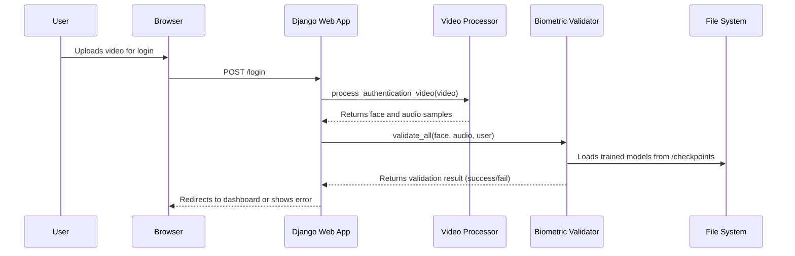

# System Architecture Document

## 1. System Architecture Overview

This document outlines the architecture of the biometric authentication system. The system is a Django-based web application that uses facial and voice recognition to authenticate users.

The architecture is designed to be modular and decoupled, with a clear separation between the web application and the machine learning models. This is achieved through a file-based data exchange mechanism and asynchronous processing for model training.

The system has two primary flows: **Registration** and **Authentication**.

-   **Registration**: A new user provides a video of themselves, which is used to train personalized facial and voice recognition models. This training happens asynchronously in the background.
-   **Authentication**: A returning user provides a new video to log in. The system uses the previously trained models to verify their identity.

The system also includes real-time features using WebSockets, likely for liveness detection, to ensure the user is a real person and not a recording.

---

## 2. Components

The system is composed of three main components:

### 2.1. Django Web Application (`src` directory)

This is the core of the system, handling user interactions, and orchestrating the biometric processes.

-   **Technology**: Django, Django Channels (for WebSockets)
-   **Responsibilities**:
    -   Serving the registration and login pages.
    -   Handling user video uploads.
    -   Managing user sessions.
    -   Orchestrating the registration and authentication flows by calling the appropriate services.
-   **Key Services**:
    -   `RegistrationService`: Manages the user registration process. It saves the user's video, triggers the `VideoProcessor` to extract training data, and then kicks off the asynchronous training via the `TrainingService`.
    -   `AuthenticationService`: Handles the login process. It uses the `VideoProcessor` to extract a face and audio sample from the login video and then uses the `BiometricValidator` to perform the identity check.
    -   `TrainingService`: A crucial component for decoupling. It runs the model training scripts (`pipeline.py`) as separate `subprocess` calls. This ensures the web application is not blocked by the computationally intensive training process.
    -   `VideoProcessor`: Extracts image frames and audio clips from videos and saves them to the file system, where they can be accessed by the machine learning pipelines.

### 2.2. Facial Recognition Module (`models/facial`)

This module contains everything related to facial recognition.

-   **Technology**: TensorFlow/Keras, `facenet-pytorch` (for preprocessing).
-   **Pipeline (`pipeline.py`)**: A standalone script that:
    1.  Loads the training data (images) from the `models/facial/data/{username}` directory.
    2.  Trains a classifier on the data. Two classifier strategies are available:
        -   **`cnn`**: A custom Convolutional Neural Network trained from scratch on the user's face.
        -   **`nn`**: A classifier (simple Neural Network) trained on embeddings extracted by a pre-trained FaceNet model.
    3.  Saves the trained model and label encoder to the `models/facial/checkpoints` directory.
-   **Data Flow**: The Django app writes the training images to the `data` directory, and the pipeline reads from it.

### 2.3. Voice Recognition Module (`models/voice`)

This module is analogous to the facial recognition module but for speaker identification.

-   **Technology**: PyTorch, SpeechBrain.
-   **Pipeline (`pipeline.py`)**: A standalone script that:
    1.  Loads audio clips from `models/voice/data/{username}`.
    2.  Uses a pre-trained SpeechBrain model (`speechbrain/spkrec-ecapa-voxceleb`) to extract a 192-dimensional embedding for each audio clip.
    3.  Trains a simple Neural Network classifier on these embeddings.
    4.  Saves the trained model and label encoder to `models/voice/checkpoints`.

---

## 3. Data Flow

### 3.1. Registration Data Flow

```mermaid
sequenceDiagram
    participant User
    participant Browser
    participant DjangoApp as Django Web App
    participant VideoProcessor as Video Processor
    participant TrainingService as Training Service
    participant Fs as File System
    participant MlPipelines as ML Training Pipelines

    User->>Browser: Uploads video for registration
    Browser->>DjangoApp: POST /register
    DjangoApp->>VideoProcessor: process_registration_video(video)
    VideoProcessor->>Fs: Saves frames to models/facial/data/{user}/
    VideoProcessor->>Fs: Saves audio to models/voice/data/{user}/
    VideoProcessor-->>DjangoApp: Returns paths to data
    DjangoApp->>TrainingService: trigger_async_training(user)
    TrainingService-))MlPipelines: (async) python pipeline.py
    MlPipelines->>Fs: Reads training data
    MlPipelines->>Fs: Saves trained models to /checkpoints
```

### 3.2. Authentication Data Flow


---

## 4. Architecture Visualization

This diagram provides a high-level overview of the complete system architecture.

```mermaid
graph TD
    subgraph User Interaction
        U[User] --> B[Browser]
    end

    subgraph Django Application (src)
        B --> V{Django Views};
        V --> RS[Registration Service];
        V --> AS[Authentication Service];
        V --> WS[WebSocket Consumers];

        RS --> VP[Video Processor];
        RS --> TS[Training Service];
        AS --> VP;
        AS --> BV[Biometric Validator];
    end

    subgraph Machine Learning (models)
        TS -- triggers --> FP[Facial Pipeline];
        TS -- triggers --> SP[Voice Pipeline];

        FP --> FS_FACE_DATA[File System: /facial/data];
        SP --> FS_VOICE_DATA[File System: /voice/data];

        FP --> FS_FACE_MODELS[File System: /facial/checkpoints];
        SP --> FS_VOICE_MODELS[File System: /voice/checkpoints];

        BV --> FS_FACE_MODELS;
        BV --> FS_VOICE_MODELS;
    end

    subgraph Data Storage
        VP --> FS_FACE_DATA;
        VP --> FS_VOICE_DATA;
    end

    style Django Application (src) fill:#f9f,stroke:#333,stroke-width:2px
    style Machine Learning (models) fill:#ccf,stroke:#333,stroke-width:2px
end
```
